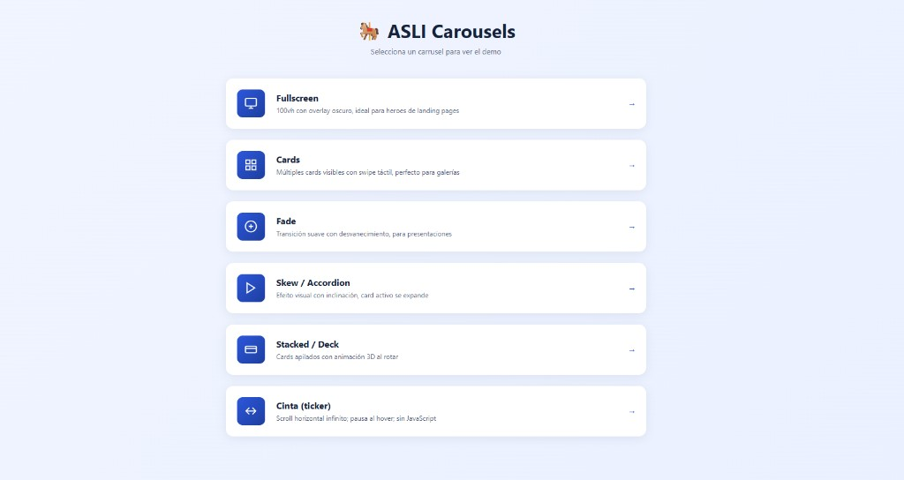
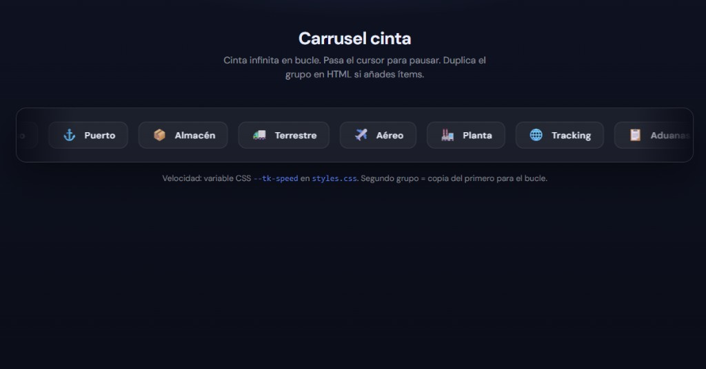

# 🎠 ASLI Carousels - Librería de Carruseles

Colección de carruseles reutilizables para tus proyectos.

## Demo en vivo

Los README de GitHub **no pueden ejecutar JavaScript**: las capturas abajo son estáticas. Para probar los componentes con interacción, usa la demo publicada o en local.

| | |
| --- | --- |
| **Producción (GitHub Pages)** | [Abrir demo](https://asli-chile.github.io/carruseles/) — misma app que con `npm run dev` |
| **En tu PC** | `npm install` y `npm run dev` |

**Activar Pages (una vez):** en el repo → *Settings* → *Pages* → *Build and deployment* → *Source* → **GitHub Actions**. El workflow [`.github/workflows/pages.yml`](.github/workflows/pages.yml) genera el sitio al hacer push a `main`.

**Tarjeta al compartir el enlace del repo:** *Settings* → *General* → *Social preview* y sube una imagen ancha (~1280×640 px). Complementa, no reemplaza, el README.

---

## Vista previa (capturas)

Índice de demos y variantes. Cada título enlaza al código en el repo; en la demo en línea, abre el mismo path bajo `carruseles/`.

### Menú de demos

[](https://asli-chile.github.io/carruseles/)

### Fullscreen

[📁 `carousel-fullscreen/`](carousel-fullscreen/) · [Demo](https://asli-chile.github.io/carruseles/carousel-fullscreen/index.html)


### Cards

[📁 `carousel-cards/`](carousel-cards/) · [Demo](https://asli-chile.github.io/carruseles/carousel-cards/index.html)


### Skew / Accordion

[📁 `carousel-skew/`](carousel-skew/) · [Demo](https://asli-chile.github.io/carruseles/carousel-skew/index.html)


### Stacked / Deck

[📁 `carousel-stacked/`](carousel-stacked/) · [Demo](https://asli-chile.github.io/carruseles/carousel-stacked/index.html)


### Cinta (ticker, solo CSS)

[📁 `carousel-ticker/`](carousel-ticker/) · [Demo](https://asli-chile.github.io/carruseles/carousel-ticker/index.html)



### Fade

[📁 `carousel-fade/`](carousel-fade/) · [Demo](https://asli-chile.github.io/carruseles/carousel-fade/index.html)

*(Sin captura en assets; ábrelo en la demo en vivo o en local.)*

---

## 📁 Estructura

```
/
├── shared/demo-media.txt      ← mismas URLs de fotos en todos los demos (referencia al cambiar imágenes)
├── index.html                 ← índice de todos los demos
├── carousel-fullscreen/
├── carousel-cards/
├── carousel-social-feed/      ← publicaciones tipo Instagram / feed
├── carousel-fade/
├── carousel-skew/
├── carousel-stacked/
├── carousel-deck-3d/          ← tres cartas en perspectiva, animación baraja
├── carousel-ticker/           ← infinito con CSS, sin JS
└── docs/                      ← capturas para el README
└── githooks/                  ← hook opcional: quita co-autor Cursor del mensaje de commit
```

### GitHub: que no aparezca «Cursor» en contribuidores

GitHub cuenta como contribuidor a quien salga en **`Co-authored-by:`** del mensaje de commit. Cursor añade por defecto:

`Co-authored-by: Cursor <cursoragent@cursor.com>`

**1. Desactivarlo en Cursor (recomendado)**  
*Cursor Settings* (no las de VS Code) → **Agents** → **Attribution** → desactiva **Commit attribution** (y *PR attribution* si no lo quieres en PRs). Reinicia Cursor si sigue apareciendo.

**2. CLI de Cursor**  
En `~/.cursor/cli-config.json` pon `"commitAttribution": false` (y `prAttribution` si aplica). Documentación: [Git | Cursor](https://cursor.com/docs/integrations/git).

**3. Hook en este repo (opcional)**  
Tras clonar o en esta copia del proyecto:

```bash
git config core.hooksPath githooks
```

El script `githooks/prepare-commit-msg` borra la línea de co-autor antes de cerrar el commit (requiere Git con `sh`, p. ej. Git Bash en Windows).

Los commits **ya subidos** con esa línea seguirán en el historial; solo los **nuevos** dejarán de sumar a Cursor. Quitar a Cursor del gráfico por completo implicaría reescribir historial (`rebase`/`filter-repo`) y un `push --force`: solo si lo necesitáis en equipo.

---

## 🚀 Uso Rápido

### 1. Copia la carpeta del carrusel que necesitas

### 2. Incluye los archivos en tu proyecto
```html
<link rel="stylesheet" href="styles.css">
<script src="carousel.js"></script>
```

### 3. Agrega el HTML y inicializa
```html
<div class="asli-carousel" data-autoplay="5000">
  <div class="asli-carousel-track">
    <div class="asli-carousel-slide">
      
      <div class="asli-carousel-overlay">
        <div class="asli-carousel-content">
          <h3>Título</h3>
          <p>Descripción</p>
        </div>
      </div>
    </div>
  </div>
  <button class="asli-carousel-btn prev">←</button>
  <button class="asli-carousel-btn next">→</button>
  <div class="asli-carousel-dots"></div>
</div>

<script>
  ASLIcarousel.init();
</script>
```

---

## ⚙️ Configuración

| Atributo | Valores | Descripción |
|----------|---------|-------------|
| `data-autoplay` | `0`, `3000`, `5000` | Ms entre slides (0 = off) |
| `data-per-view` | `2`, `3`, `4` | Cards visibles (solo cards) |
| `data-gap` | `10`, `20` | Espacio entre cards |

---

## 🎨 Imágenes Gratis

Usa imágenes de [Unsplash](https://unsplash.com) - son gratis y de alta calidad.
